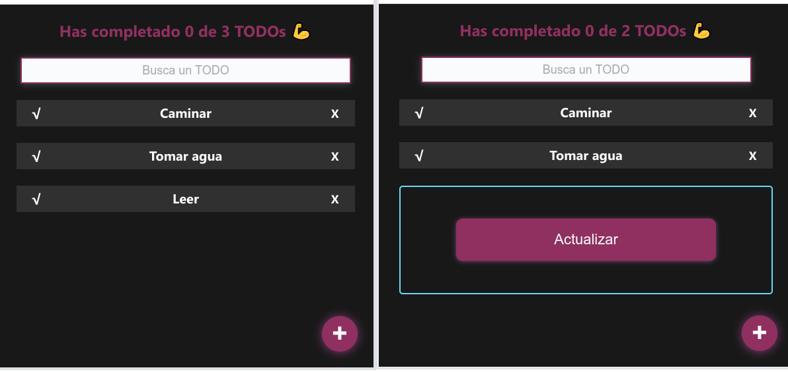

# TO-DO List

Con esta aplicación podrás llevar tu lista de tareas. 

Incluye la función de buscar, marcar como completada y eliminar.


## VISITALA :point_right: [AQUÍ](https://GuadaMongeBarale.github.io/todo-list-react) :point_left:

---
--- 

##  Proceso y características destacadas

---

### :dart: **Hooks**

Los **Hooks** fueron incorporados en React 16.8. 
Permiten, entre otras cosas, usar el estado sin necesidad de escribir una clase.

*** 

#### **useState**

Implementado para declarar variables de estado.
Entonces, durante los siguientes renderizados, nos dará el estado actual. 

Una de las implementaciones en el proyecto es en el Formulario, donde el usuario escribe su nuevo TODO. 

* Observamos el estado del `textarea`
* Combinamos esto con escuchar eventos
* Si hay un cambio en el elemento, actualizamos el estado
* Agregamos el nuevo estado como un TODO si el usuario hace click en el botón de "Añadir"

```javascript
// String vacío como valor inicial
const [newTodoValue, setNewTodoValue] = useState('')

const onChange= (event) => {
        setNewTodoValue(event.target.value)
    }
const onSubmit = (event) => {
        event.preventDefault()
        addTodo(newTodoValue)
        setOpenModal(false)
    }
```


***
#### **Custom Hook**

Creación de un hook con el fin de reutilizar código, y así, ejecutar procesos para manejar información sin afectar a otros componentes.

En la carpeta [`hooks`](src/hooks) puede encontrar el archivo `useLocalStorage`.
Contiene las funciones para almacenar en *Local Storage* las tareas creadas por el usuario.

Con `useEffect` ( hook de efecto que ejecuta el código que le enviemos dentro justo antes de renderizar el componente) y `setTimeout` (método de JavaScript que establece un temporizador) se simula el comportamiento de la aplicación si consumiera una *API* con este mismo fin.

***
#### **Contexto**

*Context* permite pasar datos a través del arbol de componentes sin necesidad de utilizar *props* en cada nivel. 

Puede ver la creación del contexto [aquí](src/TodoContext/index.js) 

Esto hace que sea muy sencillo compartir información con varios componenetes. 

Un ejemplo es el Título  y buscador de la página.

Si el usuario ya guardó TODOs se los mostrará y contará los completados


De lo contrario 


Mira con que poquitas líneas de código se consigue:

* [Título - Contador ](src/components/TodoCounter/) 

* [Buscador ](src/components/TodoSearch/)

***
***
## Versión 2 

***

En la segunda versión optimicé el código.

Deje de usar context para usar un **Custom Hook**, ya que al ser una *aplicación pequeña*, createContext no sería indispensable.

Por lo tanto, mejoré la *composición* de la app.

Ella es la encargada de importar hooks y compartirlos con los hijos. De esta manera no es necesario llamar en cada componente al contexto.

```javascript
function App() {
    const {
        error, 
        loading, 
        searchedTodos,
        totalTodos, 
        completedTodos,  
        completeTodo, 
        deleteTodo,
        search,
        setSearch, 
        openModal,
        setOpenModal,
        addTodo 
    } = useTodos()
    return (
        <>
        <TodoCounter        
            totalTodos={totalTodos}
            completedTodos={completedTodos}
            loading={loading}
        />
        <TodoSearch
            search={search}
            setSearch={setSearch}
            totalTodos={totalTodos}
            loading={loading}
        />
        <TodoList>
            {error  && <p>Hubo un error</p>}
            {loading  && <p>Estamos cargando...</p>}
            { searchedTodos.map( todo => (
            <TodoItem 
                key={todo.text} 
                text={todo.text} 
                completed={todo.completed}
                onComplete={()=>completeTodo(todo.text)}
                onDeleted={()=>deleteTodo(todo.text)}
            />
            ))}
        </TodoList>
        {!!openModal && (
            <Modal>
                <TodoForm
                    addTodo={addTodo} 
                    setOpenModal={setOpenModal}
                />
            </Modal>
        )}
        
        <CreateTodoButton
        setOpenModal={setOpenModal}
        />
            
        </>
    )
}
```

*Cabe destacar que, con un Custom Hook podemos compartir una **misma lógica** para manejar el estado, pero al llamarlo no estaremos compartiendo el mismo estado, sino creando **diferentes estados** que funcionan igual.*

***
### Sincronización

***


La aplicación escuha si en otra ventana se produjo un cambio en el almacenamiento de TODOs y avisa para que el usuario actualice su vista.

* [ Hook ](src/hooks/useStorageAlert.js) 

* [ Componente ](src/components/ChangeAlert/index.js) 
